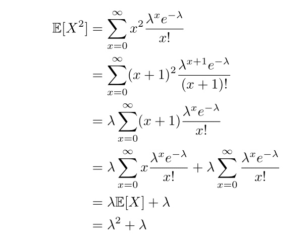

```{r setup, include=FALSE}
knitr::opts_chunk$set(echo = TRUE)
library("randomNames")
```

# R markdown

## Inserting images

Include the pictures in R markdown with the following code, `{width=50%}`.

**Exercise:** Insert a image of your choice to the workbook.

TODO: Please insert your image here

## Mathematics inside RMarkdown

The mathematical typesetting is based on LaTeX. Below are some common LaTex syntax examples.

-   Subscript $X_{i}$: `$X_{i}$`

-   Superscript $X^{i}$: `$X^{i}$`

-   Sum $\sum_{i=1}^{n} X_{i}$: `$\sum_{i=1}^{n} X_{i}$`

-   Fraction $\frac{a}{b}$: `$\frac{a}{b}$`

-   Expectation $\mathbb{E}[X]$: `$\mathbb{E}[X]$`

-   Variance $\operatorname{Var}$: `$\operatorname{Var}$`

-   Infinity $\infty$: `$\infty$`

-   Greek letters $\alpha$: `$\alpha$`

-   Aligning equations: use `align`

    $$
    \begin{align}
    \mathbb{E}[X] &= \sum_{x=0}^\infty x\frac{\lambda^x e^{-\lambda}}{x!} \\
    &= \lambda \sum_{x=1}^\infty \frac{e^{-\lambda}\lambda^{x-1}}{(x-1)!} \\
    &= \lambda e^{-\lambda} e^{\lambda} \\
    &= \lambda
    \end{align}
    $$

    ```         
    $$
    \begin{align}
      \mathbb{E}[X] &= \sum_{x=0}^\infty x\frac{\lambda^x e^{-\lambda}}{x!} \\
      &= \lambda \sum_{x=1}^\infty \frac{e^{-\lambda}\lambda^{x-1}}{(x-1)!} \\
      &= \lambda e^{-\lambda} e^{\lambda} \\
      &= \lambda
    \end{align}
    $$
    ```

Exercise: Type out the following equation in LaTex:

{width="50%"}

TODO: LaTex codes $$
% type out your equation here
$$

# Survey Sampling

## Data Generation

Suppose we have test scores for a population of 1000 students, expressed as percentages, generated from a $\text{Beta}(2,5)$ distribution. Create a data frame to store the names and scores of these students. Calculate the population mean and variance, and plot a histogram to visualize the distribution of the test scores.

```{r}
# TODO: write your codes here
```

## Mean Calculation:

Suppose that we only have access to a sample of 100 scores (with replacement). Please generate this sample and calculate its mean to estimate the population mean. Compute the bias of this estimator.

```{r}
# TODO: write your codes here
```

## Simulation Analysis: with replacement vs without replacement

(i) Suppose that we can repeat the survey process through 100,000 simulations, each sampling 100 students **with replacement**. Calculate the sample mean for each of the 100,000 simulations.

```{r}
# TODO: write your codes here
```

(ii) Check the mean, bias, and variance of the sample means.

```{r}
# TODO: write your codes here
```

(iii) Plot a histogram of sample means. Compare the sample mean to a normal distribution using a Q-Q plot.

```{r}
# TODO: write your codes here
```

(iv) Suppose we sample **without replacement** from the 100,000 simulations. Estimate the expectation, bias, and variance of the estimators. What did you learn about these quantities in your lectures? Type up the theoretical expressions of them with LaTex.

```{r}
# TODO: write your codes here
```

TODO: Latex codes $$
% write your LaTex expressions here
$$

## Assigning groups

The survey is conducted by two volunteer groups, 1 and 2, after we have randomly assigned students to these groups. A student is assigned to group 1 with probability $\frac{2}{3}$. Students attending the survey from group 1 receive a notebook, while those attending by group 2 receive a bottle. Create two columns to show which volunteer group conducted the survey and what gift the students received by `sample()` and `ifelse()`.

```{r}
# TODO: write your codes here
```

## Trimmed mean (optional)

The trimmed mean is a method to estimate a dataset's central tendency by removing a specified percentage of the smallest and largest values before calculating the average of the remaining data. This technique helps reduce the impact of outliers, providing a more reliable measure of the dataset's typical value, especially useful when data is skewed or contains extreme values. It combines the mean's sensitivity to data changes with the median's resistance to outliers, offering a robust tool for data analysis.

In R, we can calculate the trimmed mean via

```{r eval= FALSE}
sample <- pop[sample(nrow(pop), size=100,replace=TRUE),]
trim_means <- mean(sample$scores, trim=0.2) # trim the smallest 10% and largest 10% before calculating the mean.
```

Assume that our sampled data is contaminated with outliers: some students did not report their true score - a random selection of 5 student reported that their score is 1 regardless of their true score. Please include this contamination, and compare the mean and trimmed mean of your sample.

```{r}
# TODO: write your codes here
```
